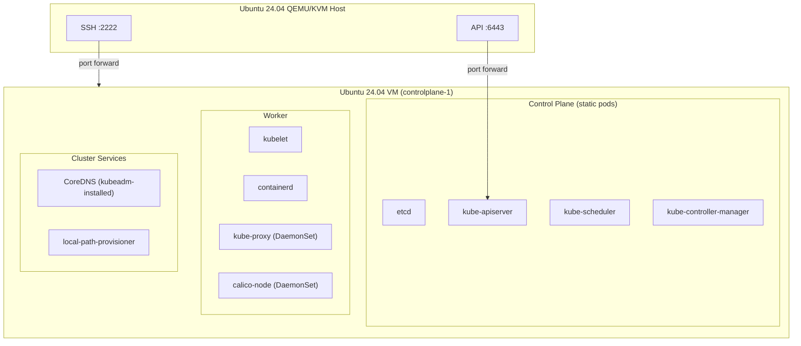

# CKA Exam Prep: Single-Node Cluster with kubeadm

This repository contains a step-by-step guide for bootstrapping a single-node Kubernetes cluster on a QEMU/KVM virtual machine using `kubeadm`. It is the kubeadm companion to the `cka/vm/single-systemd` guide, which builds the same cluster manually from raw binaries and systemd units.

The CKA exam runs on `kubeadm`-installed clusters and tests `kubeadm` lifecycle operations directly: cluster init, worker join (covered in the `two-kubeadm` guide), token rotation, certificate renewal, control plane upgrades, and etcd backup/restore against a `kubeadm` cluster. This guide gets you to a working cluster in ten minutes instead of the systemd guide's two hours, and is the right tool for practicing those exam-shaped operations.

## What You Will Build

A single QEMU/KVM virtual machine running Ubuntu 24.04 with a `kubeadm`-installed Kubernetes cluster:



The networking model and VM creation are identical to the `single-systemd` guide. Only the Kubernetes installation differs.

## Prerequisites

**Hardware:**
- x86_64 CPU with hardware virtualization enabled (Intel VT-x or AMD-V)
- At least 8 GB RAM (4 GB allocated to the VM)
- 50 GB free disk space

**Host OS:**
- Ubuntu 24.04 LTS

**Prior preparation:**
- The `single-systemd` guide is recommended first (or at least its document 01) so you understand what `kubeadm` is doing under the hood. This guide will reference back to single-systemd files when explaining what `kubeadm`-generated files correspond to.

**Time estimate:** 30-45 minutes from start to finish

## Guide Structure

The guide is split into three documents. The VM creation is reused unchanged from `single-systemd/01-qemu-vm-setup.md`, so this guide only contains what is different.

### [00 - Overview](00-overview.md)

Quick reference card with the version table, IPs, and common commands. Open this in a side window while working through the other documents.

### [01 - Node Prerequisites](01-node-prerequisites.md)

Installs containerd, runc, the CNI plugin binaries, crictl, and the `kubeadm`/`kubelet`/`kubectl` toolchain. Configures containerd for systemd cgroup management. Pins package versions so a routine `apt upgrade` does not silently bump the cluster mid-lab. Same containerd configuration as `single-systemd/04-container-runtime.md`.

**Result:** A node with a working container runtime and the `kubeadm` toolchain at v1.35.3.

### [02 - Control Plane Init](02-control-plane-init.md)

Runs `kubeadm init` with a YAML config (not flags), removes the control plane taint so workloads can run on the single node, sets up `kubectl`, and copies the kubeconfig to the host. Includes a mapping table from each `kubeadm`-generated file back to its hand-rolled equivalent in `single-systemd`.

**Result:** A functioning Kubernetes API at `https://127.0.0.1:6443` (port-forwarded from the VM). Node is `NotReady` because there is no CNI yet.

### [03 - CNI Installation](03-cni-installation.md)

Installs Calico via the Tigera operator with a custom `Installation` resource that aligns the IPPool CIDR with the `kubeadm` `podSubnet`. Verifies pod networking and `NetworkPolicy` enforcement.

**Result:** Node `Ready`, pods getting IPs from `10.244.0.0/16`, `NetworkPolicy` enforced.

### [04 - Cluster Services](04-cluster-services.md)

Installs Helm, `local-path-provisioner` for PVCs, and `metrics-server` (with the lab-only `--kubelet-insecure-tls` flag) for HPA scenarios. CoreDNS is already installed by `kubeadm init`, so the manual CoreDNS install from `single-systemd/06-cluster-services.md` is dropped.

**Result:** A complete cluster ready for every Day 1 through Day 14 scenario in the Mumshad CKA course.

## Component Versions

| Component | Version | Notes |
|-----------|---------|-------|
| Ubuntu (guest) | 24.04 LTS | Cloud image, headless |
| Kubernetes | v1.35.3 | CKA exam target version, installed via `kubeadm` |
| containerd | v2.1.3 | Same as `single-systemd` |
| runc | v1.3.0 | Same as `single-systemd` |
| cri-tools (crictl) | v1.35.0 | Matches Kubernetes minor version |
| CNI plugins (binaries) | v1.7.1 | Required by Calico |
| Calico | v3.31.0 | Tigera operator install |

## Network Layout

| CIDR | Purpose |
|------|---------|
| `10.96.0.0/16` | Service ClusterIPs (kubeadm `serviceSubnet`) |
| `10.244.0.0/16` | Pod IPs (kubeadm `podSubnet`, Calico IPPool) |
| `10.0.2.0/24` | QEMU guest network (VM gets `10.0.2.15` via DHCP) |

## VM Creation

This guide reuses the VM creation from `single-systemd`. Run that guide's document 01 (`01-qemu-vm-setup.md`) to create `controlplane-1`, then come back here.

If you already have a `controlplane-1` VM from `single-systemd`, you can reuse it. Stop any running components from the systemd build first:

```bash
ssh kube@127.0.0.1 -p 2222

# Stop systemd-managed Kubernetes components if present
for svc in etcd kube-apiserver kube-controller-manager kube-scheduler kubelet kube-proxy containerd; do
  sudo systemctl stop "$svc" 2>/dev/null || true
done

# Clean up state
sudo rm -rf /var/lib/etcd /etc/etcd /var/lib/kubernetes /var/lib/kubelet /var/lib/kube-proxy
sudo rm -rf /etc/cni/net.d /etc/kubernetes
sudo rm -rf ~/auth
```

Cleaner option: `~/cka-lab/controlplane-1/stop-controlplane-1.sh` then destroy and recreate the VM with the existing `create-node.sh`. A 40 GB qcow2 disk takes seconds to recreate from the cached cloud image.

## What This Guide Does Not Cover

- **Multi-node clusters.** See `cka/vm/two-kubeadm` for the two-node `kubeadm` build.
- **HA control plane.** Single control plane only.
- **Production hardening.** Lab-grade install with the `--kubelet-insecure-tls` shortcut on metrics-server. Never use in production.

## Source Material

The `kubeadm` configuration and Calico install steps are based on the upstream Kubernetes documentation at [kubernetes.io](https://kubernetes.io/docs/setup/production-environment/tools/kubeadm/) and the Tigera operator install guide. The structure mirrors the `single-systemd` guide so the two can be read side by side.

## Testing Status

- Last verified: 2026-04-27
- Platform: Ubuntu 24.04 LTS host
- Known issues: None
