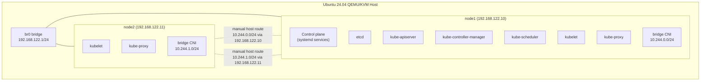

# CKA Exam Prep: Two-Node Kubernetes Cluster (systemd, From Scratch)

This repository contains a step-by-step guide for bootstrapping a two-node Kubernetes cluster on a pair of QEMU/KVM virtual machines, with every component installed as a raw binary and configured as a systemd service. No `kubeadm`, no installers, no operators. The CNI is the basic `bridge` plugin from `containernetworking/plugins` with manually-added host routes between nodes.

This is the multi-node continuation of `cka/vm/single-systemd`. Where the single-node guide stopped at one VM with QEMU user-mode networking, this guide moves to two VMs on a host bridge with real cross-node connectivity, per-node certificates, and manual route programming for pod traffic. It is a purely educational exercise: nobody runs production clusters this way, and the CKA exam itself uses `kubeadm`-installed clusters. The point is to see exactly what `kubeadm` is doing under the hood, in a setup with enough moving parts to make the seams visible.

If you want a working two-node cluster fast, use `cka/vm/two-kubeadm` instead.

## What You Will Build

Each node gets its own slice of the pod CIDR. Pod traffic between nodes crosses the bridge through host-side routes you add by hand. There is no overlay, no encapsulation, no eBPF. Just standard Linux routing.

## Prerequisites

**Hardware:**
- x86_64 CPU with hardware virtualization enabled
- At least 16 GB RAM (4 GB per VM plus host overhead)
- 100 GB free disk space

**Host OS:**
- Ubuntu 24.04 LTS

**Prior preparation:**
- Complete `cka/vm/single-systemd` first. This guide assumes familiarity with the certificate generation, systemd unit patterns, and component configuration covered there. Many sections in this guide say "same as single-systemd" rather than repeating the full instructions.

**Time estimate:** 3-4 hours from start to finish

## Guide Structure

The guide is split into seven documents.

### [00 - Overview](00-overview.md)

Quick reference card with hostnames, IPs, version table, CIDR ranges, common commands.

### [01 - Host Bridge Setup](01-host-bridge-setup.md)

Configures the Linux bridge `br0` on the host, IP forwarding, and NAT for outbound traffic so the VMs can reach the internet for package installs and image pulls. Replaces the QEMU user-mode networking from `single-systemd`.

### [02 - VM Provisioning](02-vm-provisioning.md)

Creates two headless Ubuntu 24.04 VMs (`node1`, `node2`) attached to the bridge with cloud-init and static IPs. Generates per-VM start/stop scripts and cluster-level scripts.

### [03 - Bootstrapping Security](03-bootstrapping-security.md)

Generates the cluster CA on `node1`, copies it to `node2`, then each node generates its own certificates and kubeconfigs. The certificate set differs from the single-node guide because each node now has a unique identity (`system:node:node1` vs `system:node:node2`) and the API server certificate must include both VMs' IPs in its SAN list.

### [04 - Control Plane (node1)](04-control-plane.md)

Installs etcd, kube-apiserver, kube-controller-manager, and kube-scheduler as systemd services on `node1`. Same components as `single-systemd/03-control-plane.md`, but the apiserver now binds on `0.0.0.0` and uses a certificate that includes both VMs' IPs.

### [05 - Container Runtime and Worker (Both Nodes)](05-container-runtime-and-worker.md)

Installs containerd, runc, crictl, the CNI plugin binaries, kubelet, and kube-proxy on both nodes. The CNI configuration on each node uses a per-node pod CIDR slice (`10.244.0.0/24` on `node1`, `10.244.1.0/24` on `node2`) and the kubeconfig points at the apiserver's bridge IP.

### [06 - Manual Pod Routing](06-manual-pod-routing.md)

The piece that does not exist in `single-systemd` and does not exist in `kubeadm`-installed clusters either, because Calico/Cilium/Flannel handle this automatically. With the basic bridge CNI, each node only knows how to route to its own pods. Cross-node pod traffic requires `ip route` entries on the host (or on each node) that point to the other node's pod CIDR via its bridge IP. This document explains the routing model and adds the routes.

### [07 - Cluster Services](07-cluster-services.md)

Installs Helm, CoreDNS (manually, since this is a from-scratch build), local-path-provisioner, and optionally MetalLB now that bridge networking makes it viable.

## Component Versions

| Component | Version | Notes |
|-----------|---------|-------|
| Ubuntu (guest) | 24.04 LTS | Cloud image, headless |
| etcd | v3.6.9 | Same as single-systemd |
| Kubernetes | v1.35.3 | CKA exam target version |
| containerd | v2.1.3 | Same as single-systemd |
| runc | v1.3.0 | Same as single-systemd |
| cri-tools (crictl) | v1.35.0 | Matches Kubernetes minor version |
| CNI plugins | v1.7.1 | bridge + loopback + host-local |

## Network Layout

| CIDR | Purpose | Where It Appears |
|------|---------|------------------|
| `192.168.122.0/24` | Host bridge `br0` | VM IPs (`192.168.122.10`, `192.168.122.11`), host gateway (`192.168.122.1`) |
| `10.96.0.0/16` | Service ClusterIPs | apiserver `--service-cluster-ip-range`, controller-manager `--service-cluster-ip-range`, CoreDNS ClusterIP (`10.96.0.10`), kubelet `clusterDNS` |
| `10.244.0.0/16` | Total pod IP range | controller-manager `--cluster-cidr`, kube-proxy `clusterCIDR` |
| `10.244.0.0/24` | `node1` pod slice | bridge CNI subnet on `node1` |
| `10.244.1.0/24` | `node2` pod slice | bridge CNI subnet on `node2` |

The per-node /24 slices are what make manual host routes possible. The controller-manager and kube-proxy still see the parent /16 because that is the total pod address space. Calico, Cilium, and Flannel all handle this slicing automatically with their own IPAM systems; with the basic bridge plugin you have to assign the slices yourself.

## What This Guide Does Not Cover

- **HA control plane.** Single control plane only. The certificate setup includes `controlPlaneEndpoint` so the cluster could grow to HA, but the actual HA work is out of scope.
- **kubeadm.** See `cka/vm/two-kubeadm` for the kubeadm version.
- **Production-grade CNI.** This is intentionally the basic bridge plugin so you can see exactly how pod traffic moves between nodes. For a CNI that handles routing automatically, see `two-kubeadm` which uses Calico.
- **NetworkPolicy.** The basic bridge plugin does not enforce `NetworkPolicy`. To practice `NetworkPolicy` you need Calico or Cilium, both of which are easier to install on top of `kubeadm`.
- **Three-or-more-node clusters.** The pattern extends linearly (each new node gets another /24 slice and routes are added on each node), but is not documented here.

## Source Material

The certificate, control plane, and worker installation steps are adapted from [Kubernetes the Harder Way](https://github.com/ghik/kubernetes-the-harder-way/tree/linux) by ghik (inspired by Kelsey Hightower's [Kubernetes the Hard Way](https://github.com/kelseyhightower/kubernetes-the-hard-way)). The single-systemd guide already adapted these for one node; this guide extends them back to two.

## Testing Status

- Last verified: 2026-04-27
- Platform: Ubuntu 24.04 LTS host
- Known issues: None
